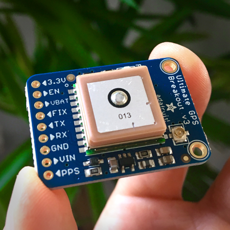

### GPSpi
A simple, end-to-end, GPS location tracking system.

---

### Prototype A
Gathers GPS data from a physical sensor and displays it on a console. 
**

Usage:
~~~
% sudo ./gpio-asm

---[ Enable GPS Sensor ]---
 > Enabling TxD... enabled!
 > Enabling RxD... enabled!

---[ Read GPS Data ]---
$GPVTG,123.45,T,,M,0.78,N,0.91,K,D*2C
$GPGGA,345670.000,8976.1234,N,01234.5678,W,2,10,1.23,456.7,M,-89.7,M,0000,0000*89
$GPGSA,A,1,23,45,67,89,01,,,,,,,,1.23,4.56,7.89*09
$GPRMC,9876543.000,A,4567.8901,N,012345.8765,W,0.12,345.67,123456,,,D*88

---[ Disable GPS Sensor ]---
 > Disabling TxD... disabled!
 > Disabling RxD... disabled!

---[ Exit ]---
~~~

---

### Prototype B
Gathers GPS data from a physical sensor and displays location information on a mobile app dashboard. 
**

Usage:
~~~
TBD
~~~

### Notes
Prototype B development currently in progress! 
